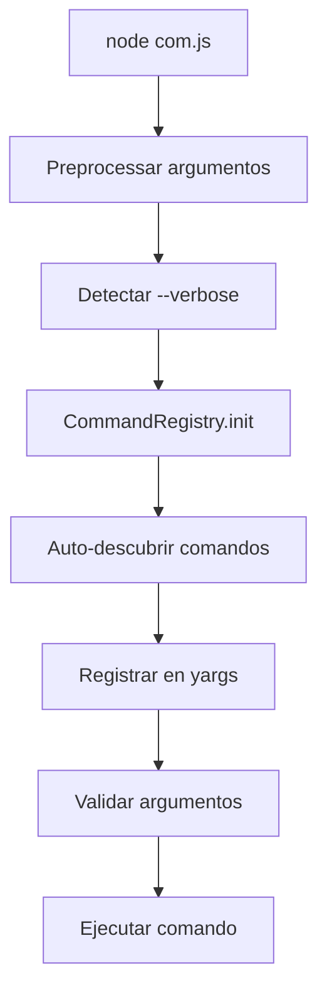

# 📦 Sistema de Comandos CLI

Un sistema de comandos modular y extensible para ejecutar tareas del backend desde la terminal de forma estructurada y escalable.

@author: Pablo Bozzolo <boctulus@gmail.com>

## 🚀 Características principales

- ✅ **Arquitectura modular**: Comandos organizados por grupos lógicos
- ✅ **ES Modules**: Soporte completo para módulos ES6
- ✅ **Auto-descubrimiento**: Registro automático de comandos
- ✅ **Sistema de alias**: Nombres alternativos para comandos
- ✅ **Validación integrada**: Validación automática de argumentos
- ✅ **Ayuda contextual**: Sistema de ayuda inteligente
- ✅ **Sintaxis dual**: Soporte para argumentos nombrados y posicionales
- ✅ **Modo verbose**: Control de verbosidad del output

---

## 📋 Uso básico

### Estructura de comandos
```bash
node com <grupo> <comando> [argumentos] [opciones]
```

### Sistema de ayuda

El sistema soporta múltiples formas de obtener ayuda:

```bash
# 1️⃣ Ayuda general - Muestra todos los grupos disponibles
node com help
node com --help

# 2️⃣ Ayuda de un grupo - Muestra todos los comandos del grupo
node com help <grupo>
node com <grupo> --help
node com make help

# Ejemplos:
node com help make
node com make --help

# 3️⃣ Ayuda de un comando específico - Muestra detalles, opciones y ejemplos
node com help <grupo> <comando>
node com <grupo> <comando> --help

# Ejemplos:
node com help make list
node com make list --help
node com help sql find
node com sql find --help
```

**💡 Tips del sistema de ayuda:**
- Todas las formas son equivalentes, usa la que prefieras
- La ayuda muestra: descripción, argumentos requeridos, opciones, alias y ejemplos
- Usa `--help --verbose` en un grupo para ver información detallada de todos sus comandos

### Ejemplos de uso
```bash
# Ejecutar comandos
node com users create-user --email=admin@example.com --password=secret123
node com typesense show-schema products
node com firebase init-collection --name=sales
node com firebase print-collection --name=stores --recursive

# Modo verbose para debugging
node com users list-users --verbose
```

### Sintaxis flexible de argumentos

**🎯 Política de parámetros: Como regla general, se prefiere y recomienda utilizar parámetros posicionales siempre que sea posible, excepto en casos donde:**
- Hay múltiples posibilidades de configuración
- Los parámetros son de uso opcional
- El orden no es intuitivo o convencional

```bash
# ✅ PREFERIDO: Sintaxis posicional (más simple y directa)
node com users show-user user@example.com
node com typesense init products
node com stores show-store store123
node com firebase list-collection products

# ✅ También válido: Sintaxis nombrada (para compatibilidad)
node com users show-user --email=user@example.com
node com typesense init --collection=products
node com stores show-store --id=store123
node com firebase list-collection --name=products

# 🎯 Mejor de ambos mundos: Posicional + opcionales nombrados
node com users delete-user user@example.com --force
node com typesense init products --force
node com stores delete-store store123 --force
```

---

## 🗂️ Estructura del proyecto

```
friendlypos_nodejs/
├── com.js                          # 🎯 Entry point del CLI
├── commands/                       # 📁 Comandos organizados por grupos
│   ├── users/                      # 👥 Gestión de usuarios
│   │   ├── CreateUserCommand.js
│   │   ├── DeleteUserCommand.js
│   │   ├── ListUsersCommand.js
│   │   └── UsersBaseCommand.js     # 🏗️ Clase base para usuarios
│   ├── typesense/                  # 🔍 Comandos de Typesense
│   │   ├── ListCommand.js
│   │   ├── ShowSchemaCommand.js
│   │   ├── MakeSchemaCommand.js
│   │   └── TypesenseBaseCommand.js
│   ├── firebase/                   # 🔥 Comandos de Firebase
│   │   ├── InitCollectionCommand.js
│   │   ├── ListCollectionCommand.js
│   │   └── FirebaseBaseCommand.js
│   ├── stores/                     # 🏪 Gestión de tiendas
│   ├── branches/                   # 🌿 Gestión de sucursales
│   ├── dev/                        # 🛠️ Herramientas de desarrollo
│   └── carts.disabled/             # 🚫 Grupo deshabilitado (ignorado automáticamente)
├── libs/
│   ├── BaseCommand.js              # 🏗️ Clase base para todos los comandos
│   ├── CommandRegistry.js          # 📋 Descubrimiento y registro automático
│   └── FirebaseFactory.js          # 🏭 Factory para servicios Firebase
└── doc/
    └── command_system.md           # 📖 Esta documentación
```

---

## 🔄 Flujo de ejecución



1. **Preprocessing**: Se procesan `--help` y argumentos posicionales
2. **Auto-discovery**: Se escanean automáticamente los directorios de comandos (excluyendo carpetas `.disabled`)
3. **Registro**: Los comandos se registran dinámicamente en yargs
4. **Validación**: Se validan argumentos según la configuración
5. **Ejecución**: Se ejecuta el comando con los argumentos validados

---

## 🚫 Deshabilitar grupos de comandos

El sistema permite deshabilitar temporalmente grupos completos de comandos sin necesidad de borrar las carpetas. Esto es útil cuando:

- Has deprecado un módulo pero quieres mantener el código para referencia
- Estás desarrollando nuevos comandos que aún no están listos
- Necesitas desactivar temporalmente funcionalidad sin perder el código

### ✅ Cómo deshabilitar un grupo

Simplemente renombra la carpeta del grupo agregando el sufijo `.disabled` al final:

```bash
# Deshabilitar el grupo de comandos "carts"
mv commands/carts commands/carts.disabled

# O en Windows
ren commands\carts carts.disabled
```

### ✅ Cómo rehabilitar un grupo

Para volver a habilitar el grupo, remueve el sufijo `.disabled`:

```bash
# Rehabilitar el grupo de comandos "carts"
mv commands/carts.disabled commands/carts

# O en Windows
ren commands\carts.disabled carts
```

### 🔍 Detección automática

El sistema de auto-discovery (`CommandRegistry.js`) ignora automáticamente:
- Carpetas que comienzan con punto (`.`)
- Carpetas que terminan con `.disabled`

**Ejemplo:**
```
commands/
├── users/              ✅ Se carga
├── stores/             ✅ Se carga
├── carts.disabled/     ❌ Se ignora automáticamente
└── .temp/              ❌ Se ignora automáticamente
```

### 💡 Ventajas

- ✅ No se pierden los archivos ni el historial de git
- ✅ Fácil de habilitar/deshabilitar sin modificar código
- ✅ Evita errores de carga si hay dependencias faltantes
- ✅ Mantiene el código organizado y disponible para referencia

---

## 🧰 Grupos de comandos disponibles

### 👥 Users
Gestión completa de usuarios con Firebase Auth
```bash
node com users create-user --email=user@example.com --role=admin
node com users delete-user --uid=abc123
node com users list-users
```

### 🔍 Typesense
Operaciones con el motor de búsqueda Typesense
```bash
# Listar todas las colecciones disponibles
node com typesense list-collections
node com typesense list-collections --detailed
node com typesense list-collections --filter=ZippyCart

# Operaciones con colecciones específicas
node com typesense show-schema products
node com typesense list users --limit=10
node com typesense make-schema sales
```

### 🗃️ SQL
Operaciones directas con bases de datos SQL (MySQL, PostgreSQL, SQLite)
```bash
# Ejecutar consultas SELECT directas
node com sql select "SELECT * FROM users WHERE active = 1" --connection=main

# Listar tablas en la base de datos
node com sql list --connection=main

# Obtener información detallada de una tabla
node com sql describe users --connection=main

# Buscar un registro por ID (primary key o campo id)
node com sql find users 1 --connection=main  # Salida en formato JSON por defecto
node com sql find users 1 --connection=main --format=table  # Mostrar en tabla
node com sql find products abc123 --connection=main --id-field=sku

# Buscar registros por campo y valor
node com sql find_by users email:user@example.com --connection=main  # Salida en formato JSON por defecto
node com sql find_by products category:electronics --connection=main
node com sql find_by users email:user@example.com --connection=main --format=table  # Mostrar en tabla

# Exportar datos a diferentes formatos
node com sql select "SELECT * FROM products" --connection=main --format=csv > products.csv
```

### 🔥 Firebase
Operaciones con Firestore y Firebase

#### Comandos de bajo nivel (Administración)
```bash
# Operaciones administrativas básicas
node com firebase init-collection --name=products
node com firebase list-collection products          # Lista nombres de documentos
node com firebase list-field-names --collection=products
```

#### Comandos de alto nivel (Exploración de contenido)
```bash
# Imprimir contenido completo de documentos
node com firebase print-collection --name=stores

# Imprimir con subcolecciones recursivas (NUEVO)
node com firebase print-collection --name=stores --recursive

# Trabajar con subcolecciones específicas usando dot notation
node com firebase print-collection --name=stores.branches

# Solo obtener conteo de documentos
node com firebase print-collection --name=stores --only-count

# Usar con modelos personalizados
node com firebase print-collection --name=products --recursive
# ⚠️ Warning: --recursive flag is not supported for this collection model
```

**📊 Diferencias clave:**

| Comando | Nivel | Propósito | Salida |
|---------|-------|-----------|--------|
| `list-collection` | **Bajo nivel** | Listar IDs de documentos | Solo nombres/IDs |
| `print-collection` | **Alto nivel** | Explorar contenido completo | Datos completos + subcolecciones |
| `list-field-names` | **Bajo nivel** | Análisis de esquema | Nombres de campos |

**🎯 Casos de uso:**

**`list-collection`** (Bajo nivel):
- ✅ Inventario rápido de documentos
- ✅ Scripts de automatización que necesitan IDs
- ✅ Verificación de existencia de documentos
- ✅ Operaciones masivas sobre documentos específicos

**`print-collection`** (Alto nivel):
- ✅ Exploración interactiva de datos
- ✅ Debugging de estructuras complejas
- ✅ Análisis de subcolecciones anidadas
- ✅ Inspección de contenido para desarrollo

### 🏪 Stores & 🌿 Branches
Gestión de tiendas y sucursales
```bash
node com stores create-store --name="Mi Tienda"
node com branches list-branches --store-id=123
```

### 🛠️ Dev
Herramientas de desarrollo y scaffolding
```bash
node com dev make-component UserCard
node com dev make-model Product
node com dev make-sample-file --name=products
```

### 🔨 Make
Sistema de scaffolding para crear nuevos comandos y grupos. Soporta trabajar con proyectos externos mediante la variable `BASE_PATH` en el `.env`.

**IMPORTANTE**: Los comandos `make` respetan la configuración de `BASE_PATH` en el archivo `.env`. Si `BASE_PATH='../llc-builder'`, los comandos se crearán en ese proyecto, no en el actual.

```bash
# Listar todos los grupos y comandos (del proyecto según BASE_PATH)
node com make list
node com make list --group=llm
node com make list --detailed

# Crear un nuevo grupo de comandos
node com make command --new-group=llm --description="Comandos para proveedores de LLM"

# Crear un comando dentro de un grupo existente
node com make command --group=llm --name=ollama-list --description="Lista modelos de Ollama"

# Crear múltiples comandos a la vez
node com make command --group=llm --name=ollama-list,ollama-prompt --description="Comandos para Ollama"

# Crear un comando con formato de especificación (grupo:comando)
node com make command llm:openai-chat --description="Chat con OpenAI"

# Crear múltiples comandos con formato de especificación
node com make command llm:list,show,delete --description="Comandos de gestión de modelos"

# Crear un comando con BaseCommand para el grupo (para lógica compartida)
node com make command --new-group=ai --name=chat --base-command --description="Chat AI"

# Sobrescribir un archivo si ya existe
node com make command --group=llm --name=ollama-status --force --description="Estado de Ollama"
```

---

## 🏗️ Workflow: Creación Completa de Modelos

Para crear un modelo completo con validación de schema desde cero, ejecuta estos comandos **en orden**:

### 1️⃣ Crear Modelo
```bash
node com dev make-model {collection_name}
```
**Genera:** `models/{CollectionName}Model.js`
- Crea la clase del modelo que extiende `Model`
- Define `entity`, `uniqueFields`, `syncToTypesense`
- Soporte para multi-tenancy con `--tenant-aware`

### 2️⃣ Crear Archivo Sample
```bash
node com dev make-sample-file --name={collection_name}
```
**Genera:** `database/firebase/samples/{collection_name}.js`
- Define la estructura del primer documento
- Usado para inferencia de schema
- Excluye campos auto-gestionados (`created_at`, etc.)

### 3️⃣ Inicializar Colección
```bash
node com firebase init-collection --name={collection_name}
```
**Efectos:**
- Usa el archivo sample para crear el primer documento
- Genera automáticamente el schema de Typesense
- Limpia datos existentes con `--force`

### 4️⃣ Generar Schema de Validación
```bash
node com firebase make-firestone-schema --collection={collection_name}
```
**Genera:** `database/firebase/schemas/{collection_name}/{collection_name}.schema.js`
- Schema para validación automática en operaciones CRUD
- Leído por `Model.async _loadSchema()`
- Define tipos, campos requeridos y subcollecciones

### 🎯 Ejemplo Completo
```bash
# Crear modelo para colección "products"
node com dev make-model products
node com dev make-sample-file --name=products
node com firebase init-collection --name=products
node com firebase make-firestone-schema --collection=products
```

### ✅ Resultado Final
- ✅ Modelo funcional con validaciones
- ✅ Schema automático para tipos y campos requeridos  
- ✅ Sincronización con Typesense
- ✅ Soft delete inteligente basado en schema
- ✅ Hooks y observadores disponibles

---

## 🧩 Sistema de alias

Los comandos pueden tener alias para mayor comodidad:

```javascript
// En el comando
this.aliases = {
  'delete-user': ['del-user', 'rm-user']
};
```

```bash
# Todos estos comandos son equivalentes
node com users delete-user --uid=123
node com users del-user --uid=123
node com users rm-user --uid=123
```

---

## 🏗️ Crear un nuevo comando

### Paso 1: Crear el archivo
```bash
touch commands/products/CreateProductCommand.js
```

### Paso 2: Implementar la clase
```javascript
import { BaseCommand } from '../../libs/BaseCommand.js';

export class CreateProductCommand extends BaseCommand {
  constructor() {
    super();
    this.command = 'create-product';
    this.description = 'Crea un nuevo producto en el sistema';
    this.examples = [
      'node com products create-product --name="Coca Cola" --price=1.99',
      'node com products create-product --name="Pepsi" --price=2.49 --category=bebidas'
    ];
    this.aliases = {
      'create-product': ['new-product', 'add-product']
    };
  }

  static get config() {
    return {
      requiredArgs: ['name', 'price'],
      optionalArgs: ['category'],
      validation: {
        price: { min: 0 }
      },
      options: {
        name: {
          describe: 'Nombre del producto',
          type: 'string'
        },
        price: {
          describe: 'Precio del producto',
          type: 'number'
        },
        category: {
          describe: 'Categoría del producto',
          type: 'string',
          default: 'general'
        }
      }
    };
  }

  async execute(argv) {
    // Lógica del comando
    this.log(`📦 Creando producto: ${argv.name}`, 'info');
    
    // ... implementación ...
    
    this.log(`✅ Producto "${argv.name}" creado exitosamente`, 'success');
    return { id: 'prod_123', name: argv.name, price: argv.price };
  }
}
```

### Paso 3: ¡Listo para usar!
```bash
node com products create-product --name="Mi Producto" --price=29.99
```

---

## 🔧 Configuración avanzada

### Validaciones personalizadas
```javascript
static get config() {
  return {
    validation: {
      email: 'email',                    // Validación de email
      password: { minLength: 6 },        // Mínimo 6 caracteres
      age: { min: 18, max: 99 },         // Rango numérico
      role: { choices: ['admin', 'user'] } // Lista de opciones
    }
  };
}
```

### Argumentos con valores por defecto
```javascript
options: {
  limit: {
    describe: 'Número de resultados',
    type: 'number',
    default: 10
  },
  format: {
    describe: 'Formato de salida',
    type: 'string',
    choices: ['json', 'table', 'csv'],
    default: 'table'
  }
}
```

### Inicialización de servicios
```javascript
// En un comando que extiende una base específica
import { FirebaseBaseCommand } from './FirebaseBaseCommand.js';

export class MyFirebaseCommand extends FirebaseBaseCommand {
  async execute(argv) {
    await this.initServices(); // Inicializa Firebase automáticamente
    
    // Usar this.firestore, this.auth, etc.
    const doc = await this.firestore.collection('users').doc(argv.uid).get();
  }
}
```

---

## 🛠️ Debugging y desarrollo

### Modo verbose
```bash
# Muestra información detallada del registro de comandos
node com users list-users --verbose
```

### Información de debugging
Todos los comandos incluyen logging consistente:
```javascript
this.log('Mensaje informativo', 'info');     // ℹ️
this.log('Operación exitosa', 'success');    // ✅  
this.log('Advertencia', 'warning');          // ⚠️
this.log('Error crítico', 'error');          // ❌
```

### Estructura de ayuda automática
El sistema genera ayuda automáticamente basada en:
- Descripción del comando
- Argumentos requeridos y opcionales  
- Ejemplos de uso
- Alias disponibles
- Validaciones configuradas

---

## 🆕 Funcionalidades recientes

### 🔄 Comandos Firebase reorganizados y mejorados

#### 📦 Comandos movidos de `collections` → `firebase`
Los comandos de exploración de colecciones se movieron al grupo firebase para mejor organización:

```bash
# ANTES (❌ ya no funciona)
node com collections print-collection --name=stores

# AHORA (✅ nueva ubicación)  
node com firebase print-collection --name=stores
```

#### 🆕 Exploración recursiva de subcolecciones
El comando `print-collection` ahora soporta exploración recursiva:

```bash
# Explorar subcolecciones anidadas
node com firebase print-collection --name=stores --recursive
```

**Características nuevas:**
- ✅ Navegación automática por subcolecciones
- ✅ Soporte para múltiples niveles de anidación  
- ✅ Detección automática de modelos personalizados
- ✅ Warnings informativos para modelos no compatibles
- ✅ Salida limpia sin logs excesivos de Firebase

**Diferenciación clara de comandos:**
- `list-collection`: **Bajo nivel** - Solo IDs para scripts/automatización
- `print-collection`: **Alto nivel** - Contenido completo para desarrollo/debugging

**Ejemplo de salida recursiva:**
```
Found 2 stores:
📄 ID: store1
   Data: { name: "Mi Tienda", ... }
  📁 Subcollections for store1:
    📂 branches (3 documents):
      📄 branch1: { name: "Sucursal Centro", ... }
    📂 orders (5 documents):
      📄 order1: { customer: "Juan", ... }
      📂 items (2 documents):
        📄 item1: { product: "Coca Cola", ... }
```

---

## 📊 Mejores prácticas

### ✅ Hacer
- **Siempre incluir ejemplos** en `this.examples`
- **Usar validaciones** para argumentos críticos
- **Extender clases base** apropiadas (UsersBaseCommand, etc.)
- **Incluir descriptions claras** y concisas
- **Manejar errores** con logging apropiado
- **Usar alias** para comandos frecuentemente usados

### ❌ Evitar
- Comandos sin validación de argumentos
- Logging inconsistente 
- Hardcodear valores que deberían ser argumentos
- Comandos sin ejemplos de uso
- Lógica compleja en el constructor

### 💡 Tips
- Usa `--verbose` para debugging durante desarrollo
- Agrupa comandos relacionados en el mismo directorio
- Usa nombres descriptivos para argumentos
- Implementa validaciones específicas para tu dominio
- Considera agregar alias para comandos largos o frecuentes

---

## 🆘 Troubleshooting

### ❌ "Command not found"
1. Verifica que el archivo termine en `Command.js`
2. Asegúrate de que la clase se exporte correctamente
3. Revisa que no contenga "Base" en el nombre
4. Usa `--verbose` para ver si se registró el comando

### ❌ "Argument validation failed"
1. Revisa la configuración en `static get config()`
2. Verifica que los argumentos requeridos estén presentes
3. Comprueba las validaciones personalizadas

### ❌ "Service initialization failed"
1. Verifica las variables de entorno
2. Asegúrate de llamar `await this.initServices()`
3. Revisa la configuración de Firebase/Typesense

---

## 📚 Referencias rápidas

### Comandos de ayuda
```bash
# Ayuda general
node com help
node com --help

# Ayuda de un grupo (3 formas equivalentes)
node com help users
node com users --help
node com users help

# Ayuda de un comando específico (2 formas equivalentes)
node com help users create-user
node com users create-user --help

# Ayuda detallada de un grupo (muestra info de todos los comandos)
node com help users --verbose
node com users --help --verbose
```

### Patrones comunes
```bash
# Listado con paginación
node com typesense list products --limit=10 --page=2

# Operaciones con confirmación
node com users delete-user --uid=123 --force

# Múltiples formatos de salida
node com stores list-stores --format=json

# Argumentos posicionales vs nombrados
node com typesense show-schema products        # Posicional
node com typesense show-schema --name=products # Nombrado
```

---

## 🎯 Conclusión

Este sistema CLI modular proporciona:

- **🔧 Extensibilidad**: Fácil agregar nuevos comandos y grupos
- **🎯 Consistencia**: Interfaz uniforme para todos los comandos  
- **🚀 Productividad**: Auto-registro y validación automática
- **📖 Documentación**: Sistema de ayuda auto-generado
- **🛠️ Debugging**: Modo verbose y logging consistente

¡Perfecto para automatizar tareas de backend en un entorno profesional y bien organizado!

---

*📅 Última actualización: Enero 2026*
*🆕 Agregado grupo de comandos `make` para scaffolding de comandos*
*🆕 Soporte para BASE_PATH en comandos make (trabajo con proyectos externos)*
*🆕 Filtrado automático de archivos BaseCommand en el sistema de registro*
*🆕 Agregado soporte para deshabilitar grupos con sufijo `.disabled`*
*🆕 Comandos de collections movidos al grupo firebase*
*🆕 Agregada exploración recursiva de subcolecciones*
*🔄 Sistema en constante evolución - Ver commits recientes para nuevas funcionalidades*